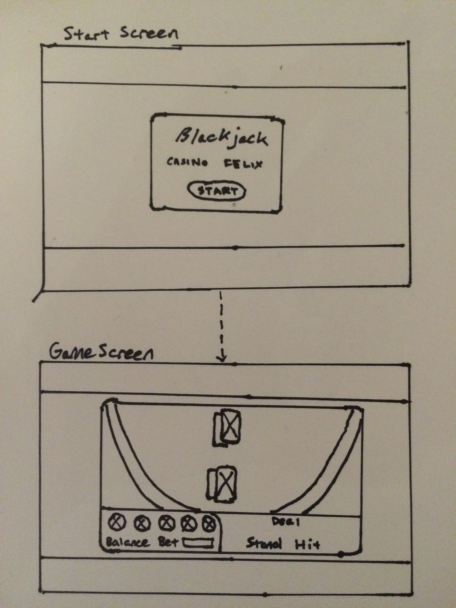

# Project One: BlackJack

##Objective
To create a functional blackjack game with HTML, CSS, and Javascript (JQuery)

##Minimum Viable Product
The MVP of this project was to create a Blackjack game that allowed players to do the following:

- A way to keep track of the current player bankroll 
- players to make a bet
- players to stand or hit
- players to bust
- players to win or tie

##Wireframe for User Interface

* * *
##Features
<ul>The Game includes the following features:
    <li>Players can place a bet</li>
    <li>Players can</li>
    <li>Play multiple rounds with each other</li>
    <li>Keep track of wins each round</li>
    <li>Keep playing even in the event of a tie</li>
    <li>Start a new game with new players</li>
</ul>